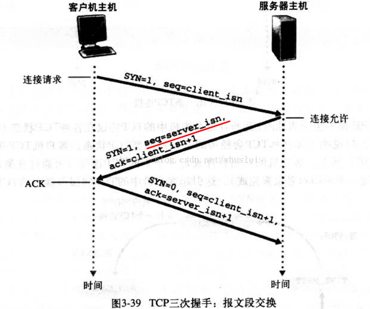

# 参考链接
[《TCP协议中的三次握手和四次挥手(图解)》——whuslei](http://blog.csdn.net/whuslei/article/details/6667471/)
# TCP协议中的三次握手和四次挥手

## 图解

<!-- more -->
## 建立连接（三次握手）
> 三次握手分别是以下三个过程
1. client发送**YSN连接请求报文**
2. server接收到请求报文后向client发送**ACK确认报文**，请过程server会为连接分配分配资源。
3. client收到ACK报文后，也会向server发送**ACK确认报文**，此时TCP连接成功。

## 断开连接（四次挥手）
> 四次挥手分别是以下四个过程
1. client发送断开连接的**FIN请求报文**，server接收到FIN请求报文
2. 如果server正在发送的数据还没有发送完毕，会**向client发送ACK报文，表示client需要继续接收未发送完的数据**，client接收到ACK报文，继续接收数据
3. server数据发送完毕，**向client发送FIN报文，表示准备关闭连接**，client接收到报文。
4. client也会**向server发送ACK报文**，表示可以关闭连接了，server接收到报文，关闭连接。

## 为什么是三次握手？两次不行吗
&emsp;&emsp;这是为了防止接收到“已失效的连接请求报文”，可能是网络延误，假设为两次握手，server一接收到“失效的连接请求报文”，就向client发送ACK报文，server开始分配资源，一直在等待client的数据，但是client在此阶段并没有连接server的需求，自然没有数据发送；这种是不安全的也是极为浪费server资源的。
> 三次握手是最优也最安全的三个过程