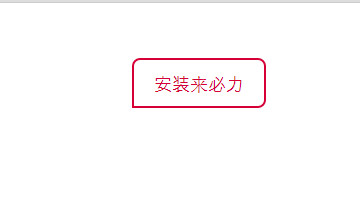
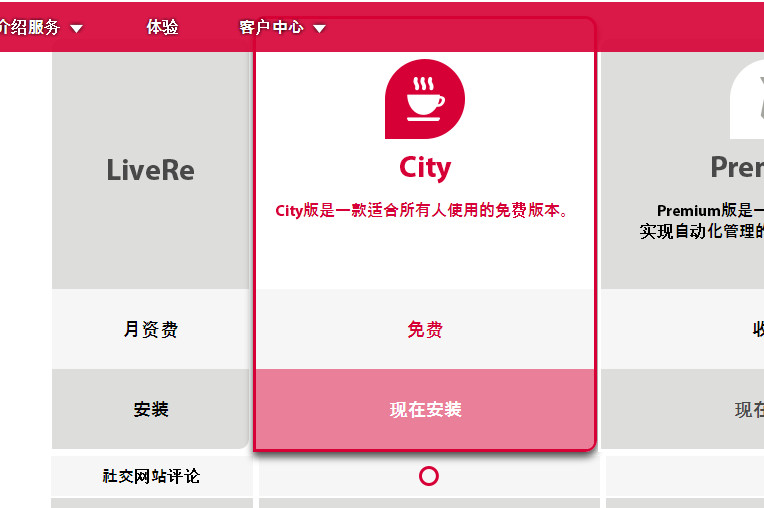
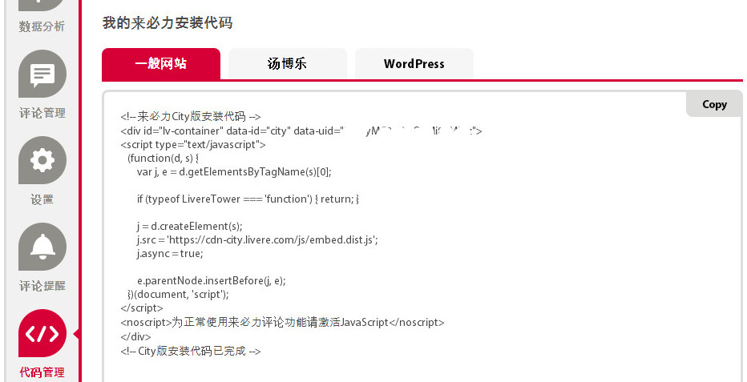
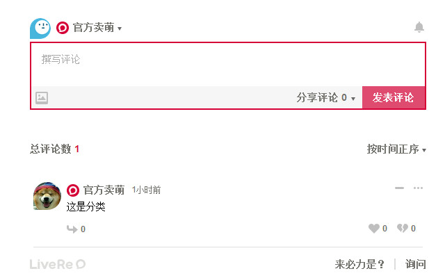

# 参考链接
[《hexo+next主题优化之加入网易云音乐、网易云跟帖、炫酷动态背景》——sunshine940326](http://blog.csdn.net/sunshine940326/article/details/69933696)

# hexo从多说评论转为韩国来必力评论
&emsp;&emsp;对于多说评论，可能很多人也知道了，就是6月1号后就不支持，公司没资金支持了吧。  
&emsp;&emsp;本来我是要用友言，集成后发现，它居然不支持https；本来也想用比较有人气的网易云跟贴的，但是注册站点的时候，它居然只支持未注册的域名，因为我不想维护我之前的域名，所以我一直直接用github提供的，github.io已经是注册的了，所以没有办法。
## 重点：关于为什么这篇文章之前评论没有了
> 发现看的人多了起来，我觉得域名有可能泄漏我的真实姓名， 所以更换了域名,本来是想，反正改了域名，还是有一些网站会爬取我的数据，我也不担心别人找不到文章了，但是突然发现之前的评论没有了，咨询来必力的客服后发现，他们的数据可能是直接关联url的，如果需要更换域名，需要代码中设定refer值，也就是每个页面都需要设定新的域名，如果javaweb可能一次性可以搞定，但是像我这种静态网站的，没得救了，**如果你需要使用来必力，请慎重选择**，如果你已经使用了来必力，对此表示歉意  
> 没有了评论感觉到文章等少了一些互动，有些没意思了的样子。

## 简介
来必力也是一个社会化评论系统，虽然是韩国的，访问速度上可能也会慢一点，不过总比没有的好啊（想想以后我的主页热门起来了，也会有很多人来评论哒，哈哈）
<!--more-->
## 注册来必力
直接到来必来注册一个账号就可以了，这个就不多说啦。
## 获取代码
有人可能会不知道怎么进入后台，我也是找了一会，才找到的。
> 就是首页拉到下面你会看到一个“去看介绍”的按钮

  

> 再拉下来点击“安装来必力”就可以进入后台了



> 当然是选择“city免费版”的咯



> 填相关站点信息（我的已经点写完了，所以没办法演示）


> 进入后台可能会点慢，耐心点，然后选择“代码管理”，我们只要“一般网站”就可以了



## 主题里面配置来必力
### 先来个文件夹简介


### 我们需要修改或者增加的文件
#### 创建文件laibili.swig
`\themes\next\layout\_scripts\third-party\comments\laibili.swig`，你也可以在文件夹下复制一个，然后修改。  以下为文件内容
`if page.comments `和倒数第二个`endif`之间为必力的javascript代码
```
 

    
      
    

   
        <!-- UY BEGIN -->
        <script type="text/javascript">
           (function(d, s) {
               var j, e = d.getElementsByTagName(s)[0];

               if (typeof LivereTower === 'function') { return; }

               j = d.createElement(s);
               j.src = 'https://cdn-city.livere.com/js/embed.dist.js';
               j.async = true;

               e.parentNode.insertBefore(j, e);
           })(document, 'script');
        </script>
        <noscript>为正常使用来必力评论功能请激活JavaScript</noscript>
        <!-- UY END -->
    
  
```
#### 修改文件third-party\comments.swig
`\themes\next\layout\_scripts\third-party\comments.swig`
增加一行代码  


#### 修改文件_partials\comments.swig  
`\themes\next\layout\_partials\comments.swig`增加div代码  
本来是想直接使用`data-uid="{{theme.laibili_uid}}"`，来引入主题配置文件中uid的，但是死活加载不出来，所以就直接写入uid了。  

```

  <div id="lv-container" data-id="city" data-uid="直接写入你的UID">
  </div>

```
#### 修改主题配置文件
`E:\blog\themes\next\_config.yml`，增加下这一行代码，由于我没有动态获取配置文件里面的uid，所以，这里的作用，也只能是判断是有配置这个代码，来决定是否嵌入评论，修改文件_partials\comments.swig里面的代码的时候，你们应该也可以看懂一点代码。
```
laibili_uid: 直接写你的uid
```
## 最后
提交hexo就可以了
```
> hexo clean
> hexo d -g

```
## 效果


