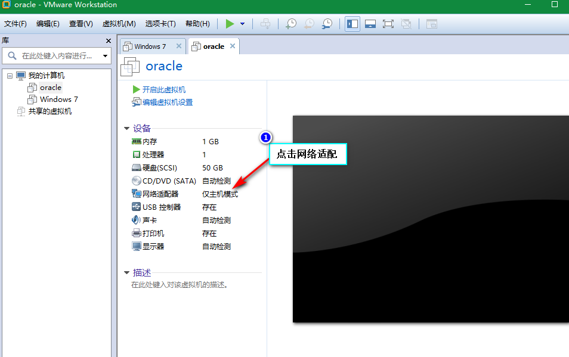
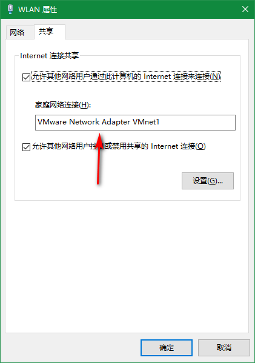
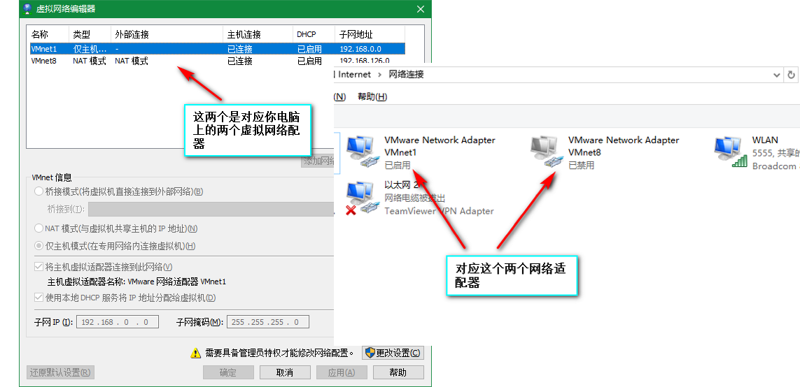
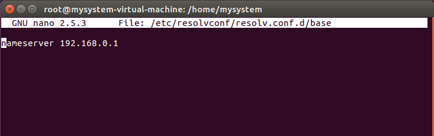

# 参考链接
[《仅主机模式上网》——邓戈麟](http://www.cnblogs.com/denggelin/p/6135582.html)  
[《ubuntu修改网络配置》——百度经验](https://jingyan.baidu.com/article/76a7e409daca52fc3b6e15e5.html)   
# vmware之ubuntu如何在仅主机模式下联网
## 仅主机模式
  

<!-- more -->
## 共享我的网络到虚拟网络适配器
> 右键“以太网”或者“无线网络适配器”-->“属性”-->勾选“允许其他用户通过此计算机的internet连接来连接”-->选择你要使用的适配器。



## 查看虚拟网络IP值
> 点击“编辑--->虚拟网络编辑”，可以看到IP自动变成了某一IP值，这是共享网络自动配置的。

  
我的是192.168.0.0
## 在ubuntu系统中修改网络配置。
> 先查看自己的网卡适配器叫什么名字
```
$ ifconfig
```
  
> 修改网卡的配置文件可以永久保存。
注意不是/etc/resolv.conf，可能由于ubuntu和其他linux系统不一样，配置文件应该是/etc/network/interfaces文件。

```
# 输入以下命令，进入修改网络配置
$sudo nano /etc/network/interfaces
```
  
Ctrl+x保存退出
> 配置 DNS
```
# 输入以下命令，进入配置DNS
$sudo nano /etc/resolvconf/resolv.conf.d/base
```  

## 测试是否能够连接网络
> 真机测试是否能访问虚拟机

> 虚拟机测试是否能访问网络


## 问题总结
### 必须编辑虚拟机网段
我就是没注意到虚拟机网段规定了起始网IP为“192.168.0.174”，终止IP为“192.168.0.281”，我设置的IP是“192.168.0.5”，明显不在这个范围了，虽然在真机上“ping 192.168.0.5”是有数据返回的（虽然我也不知道为什么），但是在虚拟机上ping真机是失败的，也不能ping上外网
## 申明
有必要申明一下，这个教程是成功，我想截一些图，但是发现虚拟机突然不能上网，一直解决不了，实在抱歉