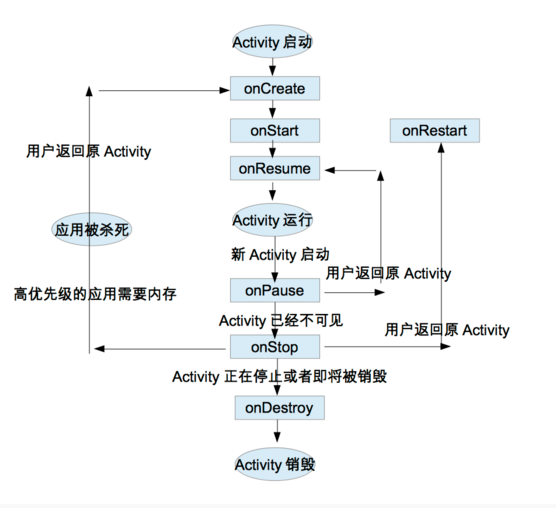

## 文章参考自
[谈谈Activity生命周期和启动模式(一)- ReturnYHH](http://www.jianshu.com/p/54cdc02ccd93)  
[谈谈Activity生命周期和启动模式(二)- ReturnYHH](http://www.jianshu.com/p/ca0d8b7680ed)  
[Activity生命周期中我们可以做些什么?-小坤同学](http://blog.csdn.net/data_hlk/article/details/51472252)  
[Activity-android Developer API doc](https://developer.android.google.cn/reference/android/app/Activity.html)
>如果有侵权行为，请及时通知我，一般不会吧-_-!

<!--more-->

# 再总结一下activity的周期吧
按back按钮、进入home screen、发生异常、横竖屏切换、更高优先级应用程序需要内存，这个几个方面入手测试总结吧。我们需要特别注意onSaveInstanceState()和onRestoreInstanceState()的调用情况。
## 先给一张标准的activity生命周期吧（中英文都给你们吧）
  

## android官方文档以三个点来总体分析activity的生命周期
### 全部的生命周期(entire lifetime)
>The entire lifetime of an activity happens between the first call to onCreate(Bundle) through to a single final call to onDestroy(). An activity will do all setup of "global" state in onCreate(), and release all remaining resources in onDestroy(). For example, if it has a thread running in the background to download data from the network, it may create that thread in onCreate() and then stop the thread in onDestroy().  
activity的全部生命周期发生在首次调用onCreate(Bundle)到最后调用onDestroy()，一个activity将在onCreate()方法里面做所有目标状态的配置，和在onDestroy()里面释放所有残留的资源。例如，一个线程在网络中正在下载所有的数据，这个activity可能在onCreate()创建这个线程并且在之后在onDestroy()停止这个线程。
### 可见生命周期(visiable lifetime)
>The visible lifetime of an activity happens between a call to onStart() until a corresponding call to onStop(). During this time the user can see the activity on-screen, though it may not be in the foreground and interacting with the user. Between these two methods you can maintain resources that are needed to show the activity to the user. For example, you can register a BroadcastReceiver in onStart() to monitor for changes that impact your UI, and unregister it in onStop() when the user no longer sees what you are displaying. The onStart() and onStop() methods can be called multiple times, as the activity becomes visible and hidden to the user.  
activity的可见生命周期发生在onStart()的调用，到在合适的情况下调用onStop()方法。在这个期间内用户可以看activity在屏幕上，即使它可能不在前台与用户交互。在这两个方法之前，你可以保留资源去展示activity给用户。例如，你可以注册一个广播接收者在onStart()监视影响用户的更改，也可以在用户不再看到你所显示的情况下，在onStop()中unregister这个广播。在activity变成显示隐藏给用户下，onStart()和onStop()方法可以被多次调用。
### 前台生命周期(foreground lifetime)
>The foreground lifetime of an activity happens between a call to onResume() until a corresponding call to onPause(). During this time the activity is in front of all other activities and interacting with the user. An activity can frequently go between the resumed and paused states -- for example when the device goes to sleep, when an activity result is delivered, when a new intent is delivered -- so the code in these methods should be fairly lightweight.  
activity的前台生命周期发生在onResume()调用，到在合适的情况下调用onPause()。在这期间activity是在所有其他的activities之前并且与用户交互。一个activity可以频繁地复位暂停状态————例如，当设备进入睡眠状态时，当一个activity结果被发布/发表时，当一个新意图被发布/发表时————因此代码在这些方法里面应该适当地做轻量工作。
## 再总结一下各个生命周期可以处理什么的事情吧 
### onCreate()
>Called when the activity is first created. This is where you should do all of your normal static set up: create views, bind data to lists, etc. This method also provides you with a Bundle containing the activity's previously frozen state, if there was one.
Always followed by onStart().  
当activity第一次被创建的时候调用。这儿应该做全部的静态安装，如**创建视图，绑定数据到列表**等等。这个方法也提供了一个Bundle（onCreate(Bundle savedInstanceState)中的参数），这个Bundle提供activity之前冻结的状态，如果有相关状态数据,**状态及数据会被恢复**。onCreate方法总是与OnStart()一起被调用。
### onRestart()
>Called after your activity has been stopped, prior to it being started again.
Always followed by onStart()  
你的activity停止后，再次优先启动后调用。总是在这之后调用onStart()  

### onStart()
>Called when the activity is becoming visible to the user.
Followed by onResume() if the activity comes to the foreground, or onStop() if it becomes hidden.  
当与onResume()一起调用使用activity进入前台，变成用户可见时调用。或者与onStop一起调用变成隐藏状态。  

>**一般可以通过在此注册broadcastReceiver来监控影响UI或者加载一些资源**
### onResume()
>Called when the activity will start interacting with the user. At this point your activity is at the top of the activity stack, with user input going to it.
Always followed by onPause().  
当activity将开始与用户交互时调用，在这一点你的actvity是在activity栈顶上，处于用户的输入。总是在这之后调用onPause()。
### onPause()
>Called when the system is about to start resuming a previous activity. This is typically used to commit unsaved changes to persistent data, stop animations and other things that may be consuming CPU, etc. Implementations of this method must be very quick because the next activity will not be resumed until this method returns.
Followed by either onResume() if the activity returns back to the front, or onStop() if it becomes invisible to the user  
系统开始正在复位之前的activity时调用。这个经常用于提交未保存的改变的持久性数据，停止动画和其他消耗CPU等等的事情。这个方法的实现必须是非常快的，因为下一个activity将不会复位，直到这个方法return后。
### onStop()
>Called when the activity is no longer visible to the user, because another activity has been resumed and is covering this one. This may happen either because a new activity is being started, an existing one is being brought in front of this one, or this one is being destroyed.
Followed by either onRestart() if this activity is coming back to interact with the user, or onDestroy() if this activity is going away.  
当activity不再显示给用户时调用，因为其他activity 复位并且覆盖它。这可能发生要么是因为一个新的activity正在启动，一个存在的activity被带到前面的这一个activity，或者这一个activity正在被摧毁。
### onDestory()
>The final call you receive before your activity is destroyed. This can happen either because the activity is finishing (someone called finish() on it, or because the system is temporarily destroying this instance of the activity to save space. You can distinguish between these two scenarios with the isFinishing() method.  
在你的activity被销毁之前最终的调用。这会发生的原因，要么是activity正在完成（某人调用finish()在activity中，或者因为系统暂时销毁地activity的实例去节省内存。）
## 影响activity生命周期的几种情况
### 按back按钮
>当前Task：A，再创建B
>以下为打印结果，当前Task:A-B

>由打印结果可以看A会预先调用OnPause()，表示开始进入暂时状态，等到目标启动B复位在前台显示时，才会执行onSaveInstanceState(Bundle outState)，再调用onStop()
```
03-27 13:29:52.938 5057-5057/com.app.androidbasic I/ActivityA: onPause: 调用了onPause  
03-27 13:29:52.968 5057-5057/com.app.androidbasic I/ActivityB: onCreate(Bundle savedInstanceState): 调用onCreate，获取当前Task的id4
03-27 13:29:52.968 5057-5057/com.app.androidbasic I/ActivityB: onStart: 调用onstart()
03-27 13:29:52.968 5057-5057/com.app.androidbasic I/ActivityB: onResume: 调用了onResume
03-27 13:29:53.398 5057-5057/com.app.androidbasic I/ActivityA: onSaveInstanceState(Bundle outState): 保存状态信息
03-27 13:29:53.398 5057-5057/com.app.androidbasic I/ActivityA: onStop: 调用onStop
```
>当B按了“back”
>以下为打印结果，此时Task:A
>Activity并没有调用onRestoreInstanceState()，可能是activity在非常状态退出，可能会调用onRestoreInstanceState()恢复activity的实例
```
03-27 13:31:53.018 5057-5057/com.app.androidbasic I/ActivityB: onPause: 调用了onPause
03-27 13:31:53.028 5057-5057/com.app.androidbasic I/ActivityA: onRestart: 调用了onRestart
03-27 13:31:53.028 5057-5057/com.app.androidbasic I/ActivityA: onStart: 调用onstart()
03-27 13:31:53.028 5057-5057/com.app.androidbasic I/ActivityA: onResume: 调用了onResume
03-27 13:31:53.438 5057-5057/com.app.androidbasic I/ActivityB: onStop: 调用onStop
03-27 13:31:53.438 5057-5057/com.app.androidbasic I/ActivityB: onDestroy: 调用onDestroy
```
### 进入home
>当前Task A-B,点击“Home”进入home screen

>B执行了onPause()-onSaveInstanceState(Bundle)-onStop()
```
03-27 13:39:22.088 5057-5057/com.app.androidbasic I/ActivityA: onPause: 调用了onPause  
03-27 13:39:22.688 5057-5057/com.app.androidbasic I/ActivityA: onSaveInstanceState(Bundle outState): 保存状态信息
03-27 13:39:22.688 5057-5057/com.app.androidbasic I/ActivityA: onStop: 调用onStop
```
>从Home恢复前台时，B并没有调用onRestoreInstanceState(Bundle)
```
03-27 13:41:55.068 5057-5057/com.app.androidbasic I/ActivityA: onRestart: 调用了onRestart
03-27 13:41:55.068 5057-5057/com.app.androidbasic I/ActivityA: onStart: 调用onstart()
03-27 13:41:55.068 5057-5057/com.app.androidbasic I/ActivityA: onResume: 调用了onResume
```
### 发生异常
#### onCreate()发生异常
>onCreate—>onPause—>onSaveInstanceState()->onStop—>onDestroy
#### onStart()发生异常
>onCreate—>onStart—>onPause—>onSaveInstanceState()->onStop—>onDestroy
#### onResume()发生异常
>onCreate—>onStart—>onResume—>onPause—>onSaveInstanceState()->onStop—>onDestroy  

### 横竖屏切换
>当前Task:A,处于坚屏状态
>当A 进入横屏状态
>onPause()->onSaveInstanceState(Bundle)->onStop()-onDestory->onCreate(Bundle)->onStart()-onRestoreInstanceState(Bundle)-onResume()
```
03-27 14:10:57.668 10213-10213/com.app.androidbasic I/ActivityA: onPause: 调用了onPause
03-27 14:10:57.668 10213-10213/com.app.androidbasic I/ActivityA: onSaveInstanceState(Bundle outState): 保存状态信息
03-27 14:10:57.668 10213-10213/com.app.androidbasic I/ActivityA: onStop: 调用onStop
03-27 14:10:57.668 10213-10213/com.app.androidbasic I/ActivityA: onDestroy: 调用onDestroy
03-27 14:10:57.668 10213-10213/com.app.androidbasic I/ActivityA: onCreate: 调用onCreate，获取当前Task的id12
03-27 14:10:57.708 10213-10213/com.app.androidbasic I/ActivityA: onStart: 调用onstart()
03-27 14:10:57.708 10213-10213/com.app.androidbasic I/ActivityA: onRestoreInstanceState(Bundle savedInstanceState): 恢复实例
03-27 14:10:57.708 10213-10213/com.app.androidbasic I/ActivityA: onResume: 调用了onResume
```
### 更高优先级的应用需要内存
onStop()->onCreate()-onStart()-onResume()

>有不对的地方，还请大神多指教

