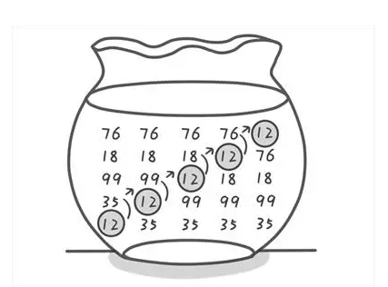

# 参考文章
[坐在马桶上看算法（2）：邻居好说话，冒泡排序](https://mp.weixin.qq.com/s?__biz=MzI1MTIzMzI2MA==&mid=2650559785&idx=1&sn=911b5c0c64338eeee7ff700ad6384ce4&mpshare=1&scene=1&srcid=0516Jp0bF32fatbH2JXkGGL4#rd)
## 公众号推荐
* 算法爱好者

<!-- more -->
# 正文
> 算法看似好像平常的工作用不到一样，实际就像我们平常吃饭，每天吃得好像没有什么时候感觉，实际上却很重要，我们就从最基础的算法上复习，从回顾基础算法上慢慢过渡到学习新算法

## 概述
> 冒泡算法，故名思义，就比如像水里的气泡一样，数字小的越来越往上飘。

* 引用“算法爱好者”公众号的图片，这个图片只示例了一个数排序，可能需要按元素的多少，来循环多次（实际可能不需要，可以优化循环次数）

## 算法解析


## 源码示例
> 建议初学，手敲代码，细细品味

```
public static void main(String[] args) {
        int score[] = {12,35,99,18,76};
        bubble(score);
        for (int i = 0; i < score.length; i++) {
            System.out.print(score[i]+" ");
        }
    }

    public static void bubble(int[] score) {
//循环上减去1，是为了防止索引越界，因为我们每次都会跟“后一个数字”比大小，索引每次都会+1
        for (int i = 0; i < score.length-1; i++) {
//每i次可能就有i个数字排序完成，所以我们长度减去i可以使算法得到优化    
            for (int j = 0; j < score.length-1-i; j++) {            
                if(score[j]>score[j+1]){
                    int temp=score[j];
                    score[j]=score[j+1];
                    score[j+1]=temp;
                }
            }
        }
    }
//控制台输出
//33 67 69 75 88 107 
```
