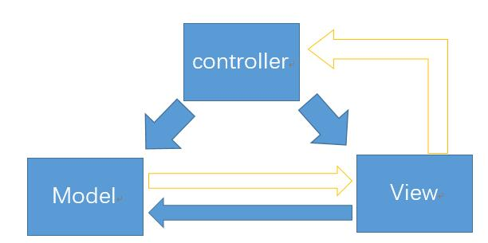
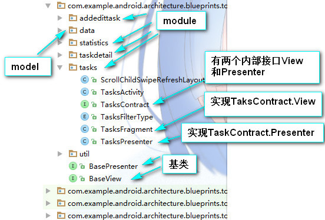

# 参考链接
[《android-architecture》-googlesample](https://github.com/googlesamples/android-architecture/tree/todo-mvp/)

# mvp设计模式
## 说明
&ensp;&emsp;和传统的mvc不同的的是，原先controller的概念变为presenter，原意为“代理”的意思，mvp设计模式中，model和view的交互完全由Presenter进行代理，简单理解就是，View请求Model时，是先发送给Presenter，Presenter收到请求，再发送请求给Model，Model响应数据回Presenter，Presenter再响应回View，此时完成交互。Model请求View也是差不多的过程。  
&ensp;&emsp;mvp设计模式在Android最为常用。
<!--more-->
## 传统MVC和MVP之间的图示比较



## google mvp
  
### BasePresenter  
```
public interface BasePresenter {
    //可以用来初始化相关的数据
    void start();

}
```
### BaseView  
```
public interface BaseView<T> {
    //view层可以引用Presenter
    void setPresenter(T presenter);
}
```
### module
#### contract  
    这个是根据具体模块，抽象更多功能的类
```
public interface TasksContract {

    interface View extends BaseView<Presenter> {
//可以再设计更多抽象方法···············
        void showTasks(List<Task> tasks);
    }

    interface Presenter extends BasePresenter {
//可以再设计更多抽象方法···············
        void loadTasks(boolean forceUpdate);
    }
}
```
#### View
    
```
public class TasksFragment extends Fragment implements TasksContract.View {
    private TasksContract.Presenter mPresenter;
//其他方法略····················
    @Override
    public void showTasks(List<Task> tasks) {
        //Presenter向model获取数据后，将回调此方法，返回有数据的tasks给View层
    }
    @Override
    public void setPresenter(@NonNull TasksContract.Presenter presenter) {
    //Presenter实例化后回调TasksContract.View 中setPresenter()方法，从而View层也获取到Presenter的引用
        mPresenter = checkNotNull(presenter);
    }
}
```
#### Presenter
```
public class TasksPresenter implements TasksContract.Presenter {
//数据层data包中的封装类
    private final TasksRepository mTasksRepository;
//view层
    private final TasksContract.View mTasksView;

    public TasksPresenter(@NonNull TasksRepository tasksRepository, @NonNull TasksContract.View tasksView) {
        mTasksRepository = checkNotNull(tasksRepository, "tasksRepository cannot be null");
        mTasksView = checkNotNull(tasksView, "tasksView cannot be null!");
//使View层得到Presenter的引用
        mTasksView.setPresenter(this);
    }
}
```

### Activity
在Activity中初始化Presenter的实现类，即可完成MVP模式的分层,view层只做视图展示，model层负责查询数据，Presenter负责View和model的代理。
```
// Create the presenter
mTasksPresenter = new TasksPresenter(
        Injection.provideTasksRepository(getApplicationContext()), tasksFragment);

```
